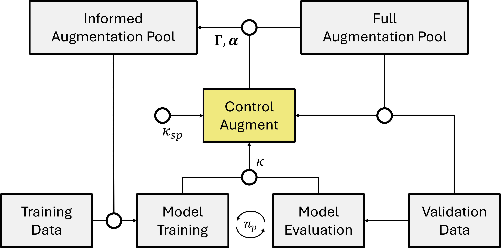

# ControlAugment (Ctrl-A)

This repository contains the official implementation of Ctrl-A, a control-driven, online data augmentation framework proposed in the paper:

> **Ctrl-A: Control-Driven Online Data Augmentation**

By incorporating aspects from control theory, Ctrl-A dynamically adapts data augmentation strength during training using feedback from training dynamics.

---

## Overview

Data augmentation is a key regularization technique in deep learning, yet most approaches rely on fixed or predefined policies. Ctrl-A introduces a closed-loop control mechanism that adjusts augmentation parameters online based on training feedback (see Figure 1).

Key ideas:
- The relative operation response (ROR) is used to determine relevant augmentation strength for each individual operation.
- A control feedback signal is derived from training dynamics (training loss versus validation loss behavior)
- The strength of data augmentation is actively adjusted as training progresses to prevent model overfitting.


*Figure 1: Illustration of the Ctrl-A setup.*

---

## Installation

```bash
# Clone the repo
git clone https://github.com/jbcdfm/ControlAugment.git
cd ControlAugment
```

```bash
# Create environment using yml file:
conda env create -f environment.yml

# Activate the environment
conda activate ctrla_env
```

---

## Quick start
An experiment can be run using the client file in the folder control_augment/
```bash
python control_augment/train_model_cli.py
```
Alternatively, an IDE-friendly local version also exists as control_augment/train_model_local.py. 

---

## Customizing experiments
The configuration files reside in src/configs, and may be selected as
```bash
python control_augment/train_model_cli.py --config config_cifar10_standard
```
In addition, single arguments may be configured as
```bash
python control_augment/train_model_cli.py --config config_cifar10_modified --epochs 300 --N 2 --kappa_sp 1
```

---

## Citation
To reference **Ctrl-A: Control-Driven Online Data Augmentation** ([arXiv:2603.21819](https://arxiv.org/abs/2603.21819)), please use:

**Christensen, J. B., et al. (2026). Ctrl-A: Control-Driven Online Data Augmentation. arXiv:2603.21819.**  
[https://arxiv.org/abs/2603.21819](https://arxiv.org/abs/2603.21819)

**BibTeX:**
```bibtex
@misc{christensen2026ctrlA,
  title        = {Ctrl-A: Control-Driven Online Data Augmentation},
  author       = {J. B. Christensen},
  year         = {2026},
  eprint       = {2603.21819},
  archivePrefix= {arXiv},
  primaryClass = {cs.CV},
  url          = {https://arxiv.org/abs/2603.21819}
}


---

## Reference repos
This work and repository were partly inspired by the simplicity of the [TrivialAugment](https://github.com/automl/trivialaugment) project.
The data augmentation operations are implemented using PyTorch’s `torchvision` package.

---


## Contact

For bug reports, questions, or suggestions, please contact: jbc@dfm.dk


---


